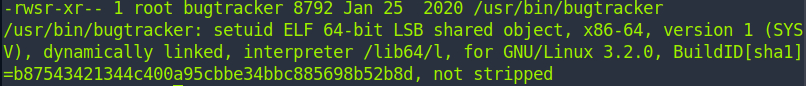

# Oopsie

#### Difficulty:<code>Very Easy</code>

#### Machine Tags:
  PHP  
  Custom Applications  
  Apache  
  Reconnaissance  
  Website Structure Discovery  
  Cookie Manipulation  
  SUID Exploitation  
  Authentication Bypass  
  Clear Text Credentials  
  Arbitrary File Upload  
  Insecure Direct Object Reference (IDOR)  
  Path Hijacking  

#### Description
  Learn about Information Disclosure and Broken Access Control while trying to a web assessment. 

#### **Initial Enumeration**
  22/tcp : ssh  : OpenSSH 7.6p1 Ubuntu
  80/tcp : http : Apache/2.4.29 (Ubuntu)

  Indicating that using SSH and visiting a webpage running on the client is possible. Based on the webpage, you can learn there is a login page for this application. For page enumeration, we can *web crawl* by tunneling requests through BurpSuite. Creating a sitemap with BurpSuite we can find the path for the login screen. 

#### **Login**
  There is the option for logging in as a Guest. Looking through the website we can see that there are tabs for account, branding, clients, and uploads. Experimenting with the tabs we can see that uploads requires *super admin* rights. On the account page we get to see the *access_id, name, and email* for the account currently logged in. 

  From comparing requests to the these credentials, we can see that a cookie holds information on the user access ID and role. I am thinking that by playing with the cookies we can access the uploads page. To do this go through *Inspect Element* and edit cookies and go to Uploads. 

  Now we can upload files onto the system, one method comes to mind for gaining more access to the target: *reverse shell*.

#### **Reverse Shell**
  After uploading a reverse shell script onto the target machine through the uploads. It comes to having it run. So we need to enumerate the target further to find where the files have been saved. After finding the path, we can simply run it by searching the path like this: <code>http://{target_ip}/{file_path}/reverse-shell.script</code>.

#### **Lateral Movement**
  To start to gain traction in the system, we need to find accounts with higher privileges. The file path for the website materials is <code>/var/www/html/cdn-cgi/login</code>. Then we can construct a grep cmd to find any mention of passwords in the source code in case that they are hard-coded in. 
  ``` bash
    cat * | grep -i passw*
  ```
  For finding users on the system we can inspect the entries on <code>/etc/passwd</code>. Unfortunately, the password that we found in the source code is not being used on the accounts we want to login to. 

  For lateral movement you need to run for the reverse shell to recognize the 'su' cmd:
  ``` bash
    python3 -c 'import pty;pty.spawn("/bin/bash")'
  ```

#### **Privilege Escalation**
  The user account that we moved to does not have sudo privileges. However, we can see that it is part of the <code>bugtracker</code> group. To find it, we can run a find command:
  ``` bash
    find / -group bugtracker 2>/dev/null

    # find              : use to search for files and dirs
    # /                 : starting point of search
    # -group bugtracker : specify only include files in bugtracker group
    # 2>                : redirect stderr stream (file descriptor 2)
    # dev/null          : file to discard anything written (basically throw out all error messages generated during exec)
  ```
  Running <code>file</code> on the file resulting from the search we see: 
  

  In this screenshot, we can see that <code>setuid</code> is set on the binary. *SUID* or *Set owner User ID* is the special permission for the user access level with a function. This function always executes as the user who owns the file, regardless of who is passing the command. If the file owner doesn't have permission, then an uppercase S would be there. 

  Thinking about this, we could probably leverage this program into gaining root execute privileges. From running the binary we can see that the program uses <code>cat</code>. So we can create the a pseudo-'cat' file in /tmp and write <code>/bin/sh</code> and change privileges. After, we can add /tmp to *PATH* environment variables to specify a set of directories where executable programs are. 

  Command for adding to path:
  ``` bash
    export PATH=/tmp:$PATH
  ```
  This would allow you to work as a root and look for the flag with root privileges. 